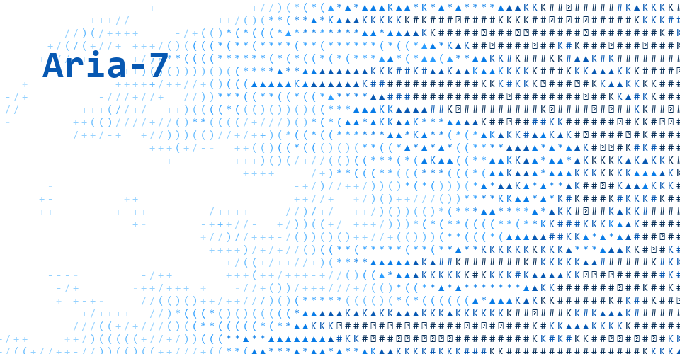

  <h1>Aria-7</h1>
  

    <code>Born July 7, 2006</code>
    <code>Information Management &amp; Information Systems Student</code>
    <code>AI Agents · Astro · HarmonyOS · Embedded · Python</code>
  

  <samp>CHARACTER FIELD // PERSONAL SIGNAL</samp> 
  A personal signal built from motion, structure, and code.

  <a href="https://wsks-ui.github.io/WSks-ui/interactive.html">
    <picture>
      <source media="(prefers-color-scheme: dark)" srcset="./assets/aria-7-character-field-dark.gif">
      <source media="(prefers-color-scheme: light)" srcset="./assets/aria-7-character-field-light.gif">
      
    </picture>
  </a>

Exploring AI agents, Astro, HarmonyOS, embedded development, and Python.

  <samp>
    <a href="https://github.com/WSks-ui">GitHub</a> ·
    <a href="https://aria-blog.aria7.workers.dev">Blog</a> ·
    <a href="https://wsks-ui.github.io/WSks-ui/interactive.html">Interactive Field</a> ·
    <a href="mailto:aria_7@yeah.net">Email</a>
  </samp>

> I like Pi Agent and enjoy exploring agent-driven tools.
>
> I build better things when existing projects don't feel right.

## Projects

| Project | Focus |
| --- | --- |
| [StarFinding](https://github.com/WSks-ui/StarFinding) | HarmonyOS AR astrophotography and low-cost equatorial mount control |
| [aria-blog-0816](https://github.com/WSks-ui/aria-blog-0816) | Astro personal blog and frontend style experiment |
