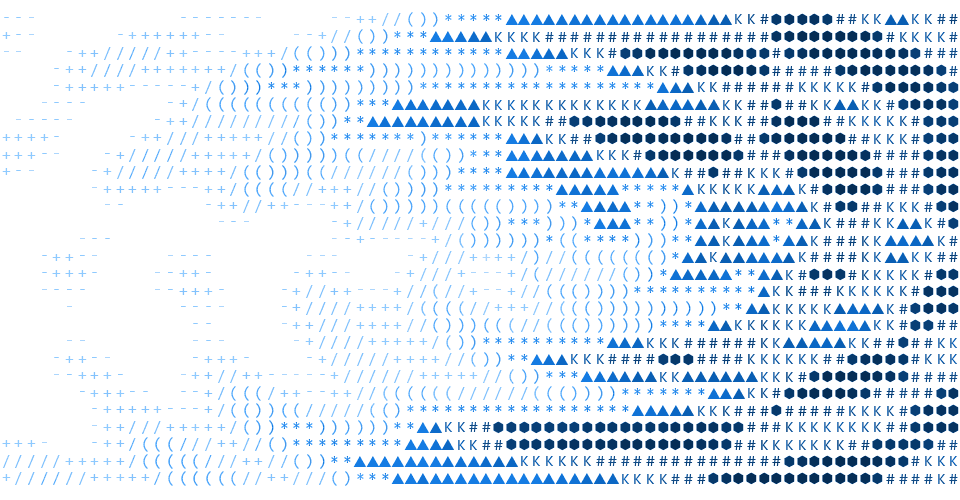

  <h1>Aria-7</h1>
  

    <code>Born July 7, 2006</code>
    <code>Information Management &amp; Information Systems Student</code>
    <code>Agent Enthusiast</code>
  

  

  <samp>
    <a href="https://github.com/WSks-ui">GitHub</a> ·
    <a href="https://aria-blog.aria7.workers.dev">Blog</a> ·
    <a href="https://wsks-ui.github.io/WSks-ui/interactive.html">ASCII Field</a> ·
    <a href="mailto:aria_7@yeah.net">Email</a>
  </samp>

- Interested in AI agents, Astro, HarmonyOS, embedded development, and Python.
- I like Pi Agent and enjoy exploring agent-driven tools.
- I build better things when existing projects don't feel right.

## Projects

- [StarFinding](https://github.com/WSks-ui/StarFinding) - HarmonyOS AR astrophotography and low-cost equatorial mount control.
- [aria-blog-0816](https://github.com/WSks-ui/aria-blog-0816) - An Astro personal blog and frontend style experiment.
